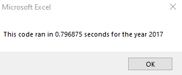
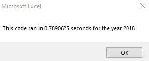
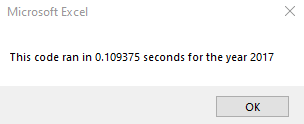
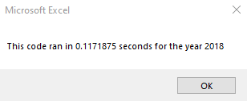

# Stock Analysis

## Overview of Project
   In this project, we looked at the impact of refactoring code has on runtime. By measuring code performance (via time it takes to run), we can see how the way code is written influences the time it takes to compile. This can be helpful information when deciding how to write our code, as merely running may be enough in most cases. However, there are times when refactoring code to improve its design and flow has tremendous payoffs. 

## Results
  //use images and examples of code. compare stock performance between the two years, as well as execution of original and refactored script 
  In our original code, performance was fairly similar between running an analysis on the 2017 data and the 2018 data, running in 0.797 seconds and 0.789 seconds, respectively. By utilizing arrays, we can eliminate the need for nested For Loops and reduce the need to run through all rows of the worksheet once for each ticker we want to check. This means the original code ran through over 3,000 rows 12 times each in the original code, but only had to run through the rows once in the refactored code, eliminating an unnecessary 33,000 instances of checking a row for a matching ticker and possibly adding the volume. 

  By refactoring the code, performance for a 2017 analysis dropped to just 0.109 seconds, and 2018 analysis took only 0.117 seconds. We were able to save 0.688 seconds for running through the 2017 data and 0.672 seconds for running through the 2018 data. This may not sound like much, but it was a roughly 86% time savings, as the refactored code ran in 14% of the time it took the original code to run. 
 
The table below summarizes the number of seconds the code took to run for each analysis year, rounded to the nearest thousandth. 

|                    | 2017          | 2018          |
| -----------------  |  ------------ | ------------- |
| Before Refactoring | 0.797         |  0.789        |
| After Refactoring  | 0.109         |  0.117        |


The following screenshots show the successful implementation of a dynamic display of the time taken for the code to run, which included concatentated strings and subtracting the timer as read at time of completion from the timer as read at the time of initilization. A sample of that code is also displayed below.  
 
  
    

  
      

```
  MsgBox "This code ran in " & (endTime - startTime) & " seconds for the year " & (yearValue)
```

  The original code (reproduced below) required nested For Loops. While looping through all 12 tickers, we looped through each row, meaning that the code in the "For j = 2 to RowCount" code block was run over 36,000 times. 
  
  ```
  For i = 0 To 11
    ticker = tickers(i)
    totalVolume = 0
    For j = 2 To RowCount

  ```

  By implementing arrays, we were able to reduce the times a code block was run to just over 3,000 times (one for each row of data). Instead of looping through the tickers, we can check the ticker value against the value we would expect from our array, and update the variables of interest in their own arrays, which are output at the end instead of after each current ticker has been checked. 

  Here we initialized our arrays;
  ```
    Dim tickerVolumes(11) As Long
    Dim tickerStartingPrices(11) As Single
    Dim tickerEndingPrices(11) As Single
  ```
  And here we looped through those same arrays to output the values of interest (after collecting the data by running through the rows);
  ```
    For i = 0 To 11
      Cells(4 + i, 1).Value = tickers(i)
      Cells(4 + i, 2).Value = tickerVolumes(i)
      Cells(4 + i, 3).Value = tickerEndingPrices(i) / tickerStartingPrices(i) - 1
    Next i 
  ```

## Summary

### Advantages and Disadvantages of Refactoring Code
  Refactoring code is a way to improve its design, causing the code to be more productive or elegant. It could increase the amount of time it takes the code to run, and could increase code readability. 

  #### Advantage
  In general, refactored code is also easier to continue to work with, so for larger projects, spending the extra time to clean up code in the early stages means that it is easier to maintain and update the code in the future. Adding comments and using explanatory names for variables can help others who use the code (or even the writers themselves) understand the code better and continue to expand the code without having to relearn what the code is doing or take the extra time to figure out why they made the choices they did. 
  
  #### Disadvantage
  However, refactoring code does take more time and effort, as one must spend time diligently seeking out the most efficient solutions and rewriting code that otherwise solves the problem. If the code will not be run multiple times, the extra invested time it takes to refactor the code may be more than the overall time saved by the code running faster after being refactored. That is, it could take a team an hour to refactor a block of code, but if the new code only saved 20 seconds on compile and is only ever ran 100 times, the team lost 26 minutes overall making these changes. However, for code that may be run many times by many users, the overall time saved can be a enormous victory. 
  
### Advantages and Disadvantages of Refactoring This VBA Script

  In our initial project for Steve, he wanted to see the return on a small number of stocks from 2017 and 2018. This code could be run multiple times, but as the data was *historical* (and not likely to change by being ran again), there was no reason for Steve to care about saving microseconds by running this data, since he would likely only run this analysis once for each year (unless he failed to save the data and wanted to check it again). However, as he asked for an updated program to search the entire stock market over multiple years, we can see why he would then care that time is saved, as he may run this many more times and it would take longer to loop through thousands of tickers instead of dozens. 

  Additionally, if Steve was going to share this program with other members of his team (if he grows his company), he would want others to be able to run the code independently, so the same code may be ran numerous times, and the time savings stack exponentially if we see a large group of people run the code multiple times. 

  #### Advantage
  An advantage to refactoring this particular code was that it did reduce our runtime. Someone may attempt to refactor code and end up having it take longer to compile, or not dramatically changing the amount of time. In this case, we can see a clear reduction in the total time the code took to compile. Another advantage is that the variables for total volume, starting prices, and ending prices are input into an array and can be accessed later, without running through each row again. (That is, until overwritten by running the code for a different year.) In our original code, the variables for startingPrice, endingPrice, and totalVolume were overwritten for each ticker as we looped through them, but in the refactored code, these variables are entered into an array and can be referenced with the tickerIndex. Without running the entire code again, we could access, say, tickerStartingPrices(4) to see the starting price of ticker "FSLR." In our original code, we lost this value once we switched to the next ticker. 

  #### Disadvantage
  The script did take additional time to refactor. While we saved 0.6 seconds on compile, an additional hour or so was invested in rewriting the code to make this improvement, so a net loss was observed in terms of total time. This is a major disadvantage for code that will not be run more than once. Additionally, we did not create a dynamic array to look at more than the 12 tickers we used for this analysis. For future projects that look at more tickers, we would want to create an array that can add new tickers to itself (by looking through a list and adding anything it does not already contain) and be able to run across tickers other than ones that were manually entered into the array. Until this is implemented, Steve will only be able to perform analyses on these 12 tickers (unless he wants to add more to the list himself or request our services again). 
  

